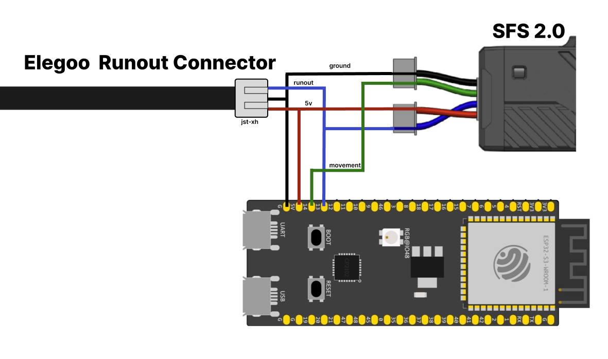
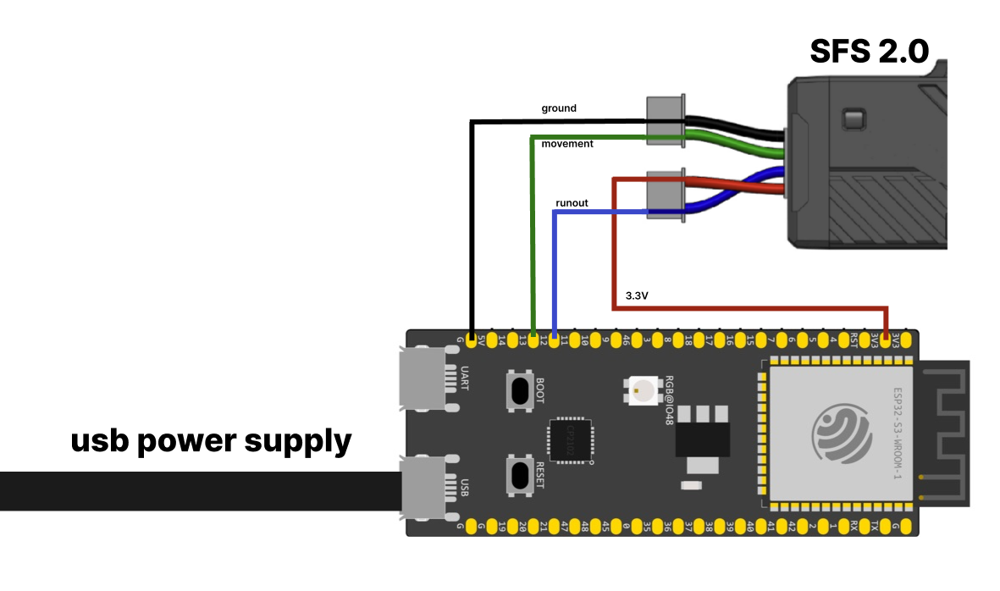
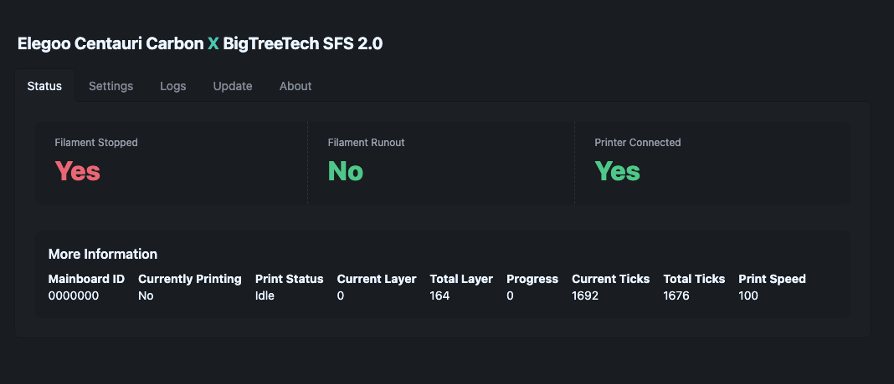

# Advanced Filament Sensor for the Elegoo Carbon Centauri

The Carbon Centauri is a great budget printer, but its filament runout sensor is a simple binary switch which cannot detect filament movement. This means the printer will print in mid-air if the filament gets tangled, breaks after the sensor, or fails to feed for any reason. This project aims to mitigate that issue with only two parts and 4 wires.

## Alternative Solutions

If you are open to flashing your CC1, I would highly recommend this project: [OpenFilamentSensor](https://github.com/harpua555/OpenFilamentSensor) which is a morea dvanced version of this idea

## Table of Contents

- [Advanced Filament Sensor for the Elegoo Carbon Centauri](#advanced-filament-sensor-for-the-elegoo-carbon-centauri)
  - [Table of Contents](#table-of-contents)
  - [How it works](#how-it-works)
  - [Video](#video)
  - [Parts List (affiliate links)](#parts-list-affiliate-links)
    - [Optional Parts](#optional-parts)
  - [Wiring (with stock runout detection)](#wiring-with-stock-runout-detection)
  - [Alternate Wiring](#alternate-wiring)
  - [Firmware Installation](#firmware-installation)
  - [WebUi](#webui)
  - [Setting the timeout (time without movement)](#setting-the-timeout-time-without-movement)
  - [3D printed case/adapter](#3d-printed-caseadapter)
  - [Known Issues / Todo](#known-issues--todo)
  - [Updating](#updating)
  - [Building from Source for unsupported boards](#building-from-source-for-unsupported-boards)
  - [Development](#development)
    - [Firmware](#firmware)
    - [Web UI](#web-ui)

## How it works

The Elegoo CC does not have an input for a filament movement sensor like the BTT SFS 2.0, but it does have an open websocket communication layer. Using a cheap off the shelf ESP32 with a Big Tree Tech SFS 2.0 as a replacment, we can track the status of the printer, detect that filament has stopped moving and send a Websocket command to pause the print. This is not as accurate as a direct firmware integration would be, and requires configuring a timeout relative to your print speed, but it can still save prints when configured correctly. The build is relatively simple, requiring only two GPIO pins, 5v, and ground connections.

## Video

## Parts List (affiliate links)

- [ESP32 S3 N8R2](https://amzn.to/4lHsUTo) for their performance, but really, any Esp32 module should work. Also tested with 4mb [ESP32 Wroom modules](https://amzn.to/4kjtDbU).
- [Big Tree Tech SFS 2.0](https://amzn.to/40uZ1wN)

### Optional Parts

- [JST-XH 3-pin connectors](https://amzn.to/4l4m1Ll) OR [PCB mount connectors](https://amzn.to/4ns8Ntx). These are only required if you wish to retain the stock runout functionality by wiring directly to the existing runout connector.
- [Electrocookie](https://amzn.to/4lqguyo) (or other) solderable PCB if you wish to do PCB mount connections rather than direct wiring

## Wiring (with stock runout detection)

_*WARNING:*_ Integrating with the stock wiring may void your Elegoo CC warranty. Do this at your own risk. Your printer may be different, make sure to validate with a multimeter before connecting any wires to the CC.

There are only 4 wires used in this project. All connectors are JST-XH 3 pin connectors, even though only 2 pins are used on each of the two SFS 2.0 connectors.

| Wire              | Color |
| ----------------- | ----- |
| Ground            | Black |
| 5V power          | Red   |
| Runout            | Blue  |
| Movement (motion) | Green |

The Elegoo runout sensor connector has 5v, ground, and runout input
Connect 5v from the elegoo to 5vin on esp32, and 5v on the SFS2.0
Connect ground from the elegoo to ground on SFS2.0 and the ESP32
Connect runout from the elegoo to pin 12 on the ESP32 and the blue wire on the SFS 2.0
Connect the green wire from the SFS 2.0 to pin 13 on the ESP32

## Alternate Wiring

If you don't want to connect the device directly to the runout sensor, you may choose to simply disable the runout built-in runout detection and rely entirely on this project to pause the print. In that case, you can power the project from USB and connect the SFS wires to to the ESP32. Red to 5v, green to pin 13, blue to pin 12, and black to ground.

## Firmware Installation

1. Flash the firmware and filesystem, this can be done through the [web tool](https://jonathanrowny.com/cc_sfs/)
2. Once it's flashed, it will create a WiFi network called ElegooXBTTSFS20, connect to it with the password elegooccsfs20
3. Go to http://192.168.4.1 in your browser to load the user interface
4. Enter your wifi ssid, password, elegoo IP address and hit "save settings", the device will restart and connect to your network.
5. Access the web UI at anytime by going to http;//ccxsfs20.local

## WebUi

The WebUI shows the current status, whether filament has runout or stopped. It can be accessed by IP address or by going to [ccxsfs20.local](http://ccxsfs20.local) if you have mdns enabled on your network.

## Setting the timeout (time without movement)

The BTT is meant to integrate with kipper or marlin firmware directly where the firmware knows how much filament _should_ be flowing. With the carbon, we can't know exactly how much it should be flowing, or at leaset, I haven't found a way. Therefore we use a timeout to aproximate how tolerant we should be to filament stopage. The BTT sensor reports an alternating value of HIGH/LOW (0/1) each time it detects the filament has moved 2.8mm. Each time it flips, we reset the timeout. If the value has not flipped after the timeout value has elapsed, the print is paused.

Setting the value too low, will mean that your prints might pause unexpectedly. Setting the value too high means your print may not be savable. Settings that impact the flow of your print may also require you to retune this value. The only way I've found to do this so far is to set the value low, start a test print, and then increase it until it reliably prints without pausing.

Note: the first layer uses 2 X Timeout because it is usually a slower flow layer and if you get a jam on your first layer, you're probably going to want to start over again anyway.

## 3D printed case/adapter

The files are available in [models](/models) directory or on [MakerWorld](https://makerworld.com/en/models/1594174-carbon-centauri-x-bigtreetech-sfs-2-0-mod)

## Known Issues / Todo

- [ ] Prints with ironing will fail, as there is no filament movement
- [ ] update from GH rather than using easyota
- [ ] use UDP ping to find/update Elegoo CC ip address like octoeverywhere does
- [ ] maybe integrate with octoeverywhere as an alternative client, so you don't need another rpi or docker container?
- [ ] support more boards like the Seeed Studio XIAO S3
- [ ] printhead cover fall protection

## Updating

Updates are available in the web ui in the update tab or by reflashing via the web tool, however, flashing through the webtool will erase all settings. Updating using the update section of the web ui will not override your settings as long as you use the `firmware-only.bin` from the [releases page](https://github.com/jrowny/cc_sfs/releases).

## Building from Source for unsupported boards

This project uses PlatformIO and building is as easy as adding the VSCode extension and hitting build. You can modify the `platformio.ini` file to support any custom board.

## Development

### Firmware

C++ code is a platformio project in `/src` folder. You can find more info [in their getting started guide](https://platformio.org/platformio-ide).

### Web UI

Web UI code is a [SolidJS](https://www.solidjs.com/) app with [vite](https://vite.dev/) in the `/webui` folder, it comes with a mock server. Just run `npm i && npm run dev` in the web folder.
Use `npm run build` in the `/web` folder to copy code into the `/data` folder, followed by `Upload file sytem image` command from PlatformIO
